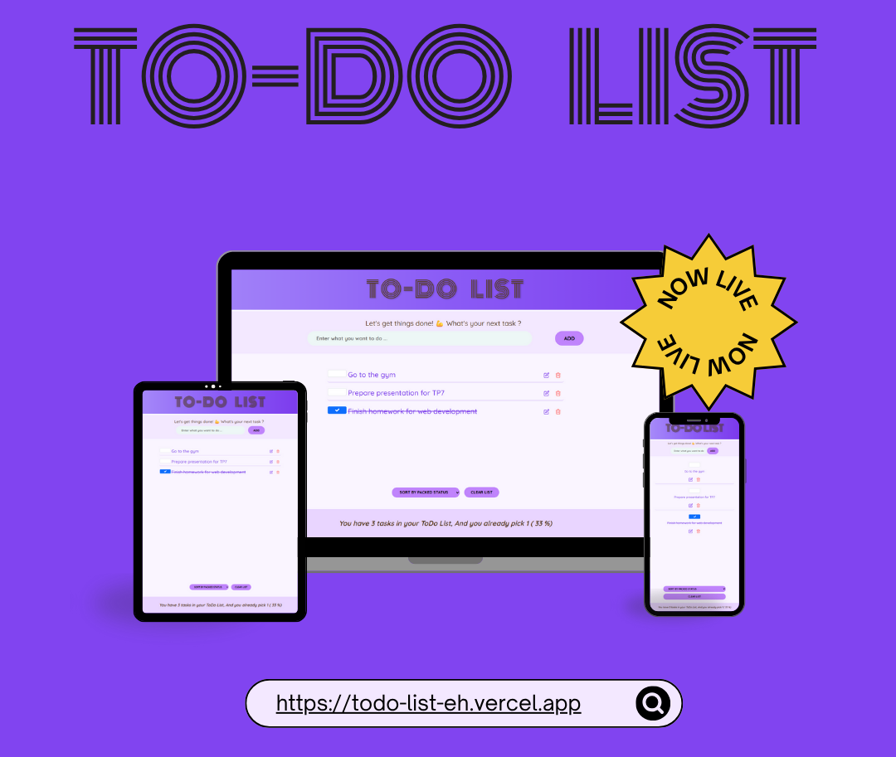

# Todo List (React)

## Overview

Interactive todo list built in React with a modern, responsive UI. Users can add, edit, mark as done, and delete tasks. The layout adapts across devices, displaying each task vertically with intuitive icons and hover feedback. Styling uses a soft purple gradient theme and Bootstrap utilities for spacing and alignment.

An optional PHP + MySQL backend is provided for persisting tasks; the app can also run in purely client-side mode with in-memory state.

## Features

- Add tasks with uniqueness checks to prevent duplicates
- Toggle task completion and visualize it with strike-through styling
- Inline edit and delete controls with icon buttons
- Responsive layout: checkbox top-center, text centered, actions at bottom on small screens
- Hover effects for better interaction cues
- Optional persistence with PHP API and MySQL database

## Tech Stack

- React (create-react-app)
- Bootstrap 5 utilities
- Custom CSS
- Optional backend: PHP 8+, MySQL 5.7+/8.x

## Getting Started (Frontend Only)

1. **Install dependencies**
   ```bash
   npm install
   ```
2. **Run the development server**
   ```bash
   npm start
   ```
3. Open http://localhost:3000/ in your browser.

The app will store tasks in memory for the current session.

## Optional: PHP + MySQL Backend

To persist tasks, connect the React app to the provided PHP API.

### Database Setup

```sql
CREATE DATABASE IF NOT EXISTS todolist;
USE todolist;

CREATE TABLE IF NOT EXISTS todo (
  id BIGINT(20) NOT NULL AUTO_INCREMENT,
  title VARCHAR(2048) NOT NULL,
  done TINYINT(1) NOT NULL DEFAULT '0',
  created_at TIMESTAMP NOT NULL DEFAULT CURRENT_TIMESTAMP,
  PRIMARY KEY (id)
);
```

### API Endpoints

Create an `api/` directory at the project root containing:

```
api/
├── config/
│   └── db.php
├── add_todo.php
├── clear_todos.php
├── delete_todo.php
├── get_todos.php
└── update_todo.php
```

`config/db.php` should open a MySQL connection and send CORS headers. Each endpoint reads/writes JSON and returns `{ success, data, message }`.

### Running the API

1. Place the project inside your PHP server root (e.g., `htdocs/todo-list` for XAMPP).
2. Update MySQL credentials in `api/config/db.php`.
3. Ensure the API is reachable, e.g., `http://localhost/todo-list/api/get_todos.php`.
4. Update `API_BASE_URL` in `src/App.js` to the API path and uncomment the fetch logic if you want the React app to consume the backend.

## Available Scripts

| Command          | Description                       |
| ---------------- | --------------------------------- |
| `npm start`      | Runs the app in development mode. |
| `npm run build`  | Bundles the app for production.   |
| `npm test`       | Launches the test runner.         |
| `npm run eject`  | Ejects configuration (irreversible). |

## Customization Tips

- Colors and hover styles live in `src/index.css`. The current palette uses purple gradients (`#a78bfa`, `#8b5cf6`, `#7c3aed`) and blush accents (`#ff6b6b`).
- Icons are inline SVGs defined in `src/Components/PackingList.js`, making it easy to adjust size or colors.
- Bootstrap classes control responsive layout; tweak column classes in `PackingList.js` for alternative arrangements.

## 🚀 Live Demo

[https://todo-list-eh.vercel.app/](#) <!-- Add your deployed link here -->

## 📸 Screenshots



---

Made with ❤️ to keep productivity on track.

