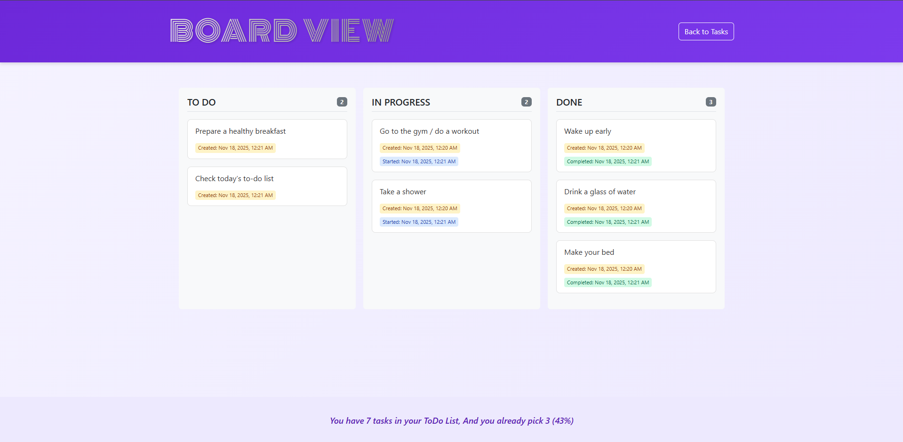
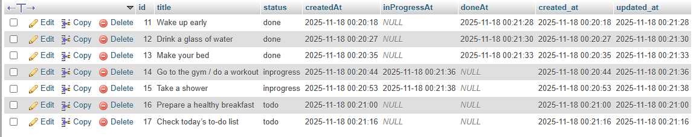

# 📝 ToDo List Application

A modern, full-stack todo list application with a board view, built with React, PHP, and MySQL. Features drag-and-drop functionality, task status tracking, and timestamp management.

## ✨ Features

- ✅ **Task Management**: Create, edit, delete, and organize tasks
- 📊 **Two Views**:
  - **Tasks Page**: List view with sorting and filtering
  - **Board Page**: Kanban-style board with drag-and-drop
- 🎨 **Status Tracking**: Three statuses (Todo, In Progress, Done)
- ⏰ **Timestamp Tracking**: Automatic timestamps for task creation and status changes
- 📱 **Responsive Design**: Works seamlessly on desktop, tablet, and mobile devices
- 🎯 **Sorting Options**: Sort by input order, description, or status
- 🖱️ **Touch Support**: Mobile-friendly drag-and-drop for board view
- 💾 **Database Integration**: Persistent storage with MySQL backend

## 🛠️ Tech Stack

### Frontend

- **React 19.2** - UI library
- **Vite** - Build tool and dev server
- **Zustand** - State management
- **React Router** - Navigation and routing
- **Bootstrap 5.3** - Responsive styling
- **HTML5 Drag & Drop API** - Drag-and-drop functionality

### Backend

- **PHP** - Server-side API
- **MySQL** - Database
- **PDO** - Database abstraction layer

## 📋 Prerequisites

Before you begin, ensure you have the following installed:

- **Node.js** (v16 or higher) and npm
- **XAMPP** (or any PHP/MySQL server)
- **MySQL** (included with XAMPP)
- **Git** (optional, for cloning)

## 🚀 Installation

### 1. Clone or Download the Project

```bash
# If using Git
git clone <repository-url>
cd todo-list

# Or download and extract the project folder
```

### 2. Install Frontend Dependencies

```bash
npm install
```

### 3. Set Up Backend

#### Option A: Using XAMPP (Recommended)

1. Copy the entire `todo-list` folder to `C:\xampp\htdocs\`
2. Your project should be at: `C:\xampp\htdocs\todo-list\`

#### Option B: Using a Different Server

- Place the `api` folder in your web server's document root
- Update the `API_URL` in `src/store/useTaskStore.js` to match your server path

### 4. Create Database

1. Open **phpMyAdmin** (usually at `http://localhost/phpmyadmin`)
2. Create a new database named `todolist`
3. Run the following SQL script:

```sql
CREATE DATABASE IF NOT EXISTS todolist CHARACTER SET utf8mb4 COLLATE utf8mb4_unicode_ci;
USE todolist;

CREATE TABLE IF NOT EXISTS todo (
  id INT UNSIGNED AUTO_INCREMENT PRIMARY KEY,
  title VARCHAR(255) NOT NULL,
  status ENUM('todo','inprogress','done') NOT NULL DEFAULT 'todo',
  createdAt DATETIME DEFAULT NULL,
  inProgressAt DATETIME DEFAULT NULL,
  doneAt DATETIME DEFAULT NULL,
  created_at TIMESTAMP DEFAULT CURRENT_TIMESTAMP,
  updated_at TIMESTAMP DEFAULT CURRENT_TIMESTAMP ON UPDATE CURRENT_TIMESTAMP
);
```

### 5. Configure Database Connection

Edit `api/config/db.php` and update the database credentials if needed:

```php
private $host = 'localhost';
private $db_name = 'todolist';
private $username = 'root';
private $password = ''; // Change if your MySQL has a password
```

## 🏃 Running the Application

### 1. Start XAMPP Services

- Start **Apache** and **MySQL** from the XAMPP Control Panel

### 2. Start Frontend Development Server

```bash
npm run dev
```

The React app will be available at `http://localhost:5173` (or the port shown in terminal)

### 3. Access the Application

- **Frontend**: `http://localhost:5173`
- **Backend API**: `http://localhost/todo-list/api/index.php`

## 📁 Project Structure

```
todo-list/
├── api/
│   ├── config/
│   │   └── db.php          # Database connection configuration
│   └── index.php           # Main API endpoint (handles all CRUD operations)
├── src/
│   ├── components/
│   │   ├── Column.jsx       # Board column component
│   │   ├── Layout.jsx       # Main layout wrapper
│   │   ├── TaskCard.jsx     # Individual task card component
│   │   └── TasksInput.jsx   # Task input form
│   ├── pages/
│   │   ├── Board.jsx        # Kanban board page
│   │   └── Tasks.jsx         # Tasks list page
│   ├── store/
│   │   └── useTaskStore.js  # Zustand state management
│   ├── App.jsx              # Main app component
│   └── main.jsx             # Entry point
├── public/                   # Static assets
├── index.html               # HTML template
├── package.json             # Node dependencies
└── vite.config.js           # Vite configuration
```

## 🎮 Usage

### Tasks Page

- **Add Task**: Type in the input field and click "ADD"
- **Edit Task**: Double-click on a task title to edit
- **Change Status**: Use the dropdown to change task status (Todo → In Progress → Done)
- **Delete Task**: Click the delete button (trash icon)
- **Sort Tasks**: Use the sort dropdown to organize tasks
- **Clear All**: Click "CLEAR LIST" to delete all tasks

### Board Page

- **View Tasks**: See all tasks organized in columns by status
- **Drag & Drop**: Drag tasks between columns to change status
- **Mobile Support**: Touch and drag on mobile devices
- **Timestamps**: View when tasks were created, started, and completed

## 📸 Screenshots

### Todo Page :


### Board View :



### Todo Database :



## 🔌 API Endpoints

The backend API (`api/index.php`) handles all operations via HTTP methods:

### GET - Fetch All Tasks

```
GET http://localhost/todo-list/api/index.php
```

Returns: Array of all tasks

### POST - Create New Task

```
POST http://localhost/todo-list/api/index.php
Body: { "title": "Task title" }
```

Returns: Created task object

### PUT - Update Task

```
PUT http://localhost/todo-list/api/index.php
Body: { "id": "123", "status": "inprogress" }  // Update status
Body: { "id": "123", "title": "New title" }    // Update title
Body: { "id": "123", "status": "done", "title": "New title" }  // Update both
```

Returns: Updated task object

### DELETE - Delete Task

```
DELETE http://localhost/todo-list/api/index.php?id=123
```

Returns: `{ "success": true }`

## 📊 Task Data Structure

Each task has the following structure:

```javascript
{
  id: "1234567890",           // Unique task ID (string)
  title: "Complete project", // Task title
  status: "todo",             // Status: "todo", "inprogress", or "done"
  createdAt: "2024-01-15T10:30:00Z",      // ISO timestamp when created
  inProgressAt: "2024-01-16T14:20:00Z",    // ISO timestamp when moved to inprogress
  doneAt: "2024-01-17T16:45:00Z"          // ISO timestamp when completed
}
```

## 🎨 Timestamp Behavior

- **Created**: Set automatically when task is created
- **In Progress**: Set when status changes to "inprogress" (only once)
- **Done**: Set when status changes to "done" (only once)
- **Backward Changes**: Old timestamps are preserved (not erased)

## 🐛 Troubleshooting

### Database Connection Error

- Ensure MySQL is running in XAMPP
- Check database credentials in `api/config/db.php`
- Verify database `todolist` exists

### API Not Responding

- Ensure Apache is running in XAMPP
- Check that `api` folder is in `htdocs/todo-list/`
- Verify API URL in `src/store/useTaskStore.js` matches your setup

### CORS Errors

- The backend includes CORS headers for development
- For production, update CORS settings in `api/index.php`

### Tasks Not Persisting

- Check browser console for API errors
- Verify database connection
- Check PHP error logs in XAMPP

## 📝 Scripts

```bash
# Start development server
npm run dev

# Build for production
npm run build

# Preview production build
npm run preview

# Run linter
npm run lint
```

## 🔒 Security Notes

⚠️ **For Development Only**: This setup is configured for local development. For production:

- Use environment variables for database credentials
- Implement proper authentication/authorization
- Add input validation and sanitization
- Use HTTPS
- Configure proper CORS policies
- Add rate limiting

## 📄 License

This project is open source and available for personal and educational use.

## 🤝 Contributing

Contributions, issues, and feature requests are welcome!

## 👤 Author

- Hermouch Abdelmajid
- Anass Et-tai

Created with ❤️ for managing tasks efficiently.

---

**Happy Task Managing! 🎉**
